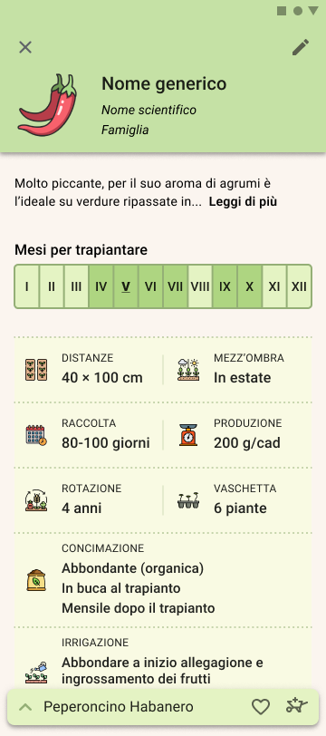

# Plantalot

Plantalot is an Android app developed in Italian for the course "Laboratory of Programming for Mobile Systems and Tablets", created in collaboration with [Davide Vecchi](https://github.com/davidevecchi) (davidevecchi) and [itakello](https://github.com/itakello) (itakello).

The goal of the app is to help users organize and maintain their home vegetable garden by providing detailed information on a wide variety of vegetables:



## Features
- Vegetable catalog with detailed profiles (growth space requirements, number of plants per area, plant compatibility, etc.)
- Geometric garden creation and management
- Placement suggestions based on agronomic factors
- Polished user interface with custom components and strong focus on usability

## Motivation
The idea originated from our own experience while living together and trying to efficiently organize our home vegetable garden. We considered space, companion planting, and growth requirements. We invested significant effort in the user experience, designing custom components and refining every detail.

## Project Status
- App language: Italian only
- Completion: Course project, not a production release

## Installation and Build

### Prerequisites
- Android Studio
- JDK 8 or higher

### Build from Command Line
```bash
git clone <repository-url>
cd Plantalot
./gradlew assembleDebug
```

Open the project in Android Studio and run it on a device or emulator.

## Project Structure
- `app/src/main/java/com/plantalot`: source code (activities, fragments, adapters, components, helper classes)
- `app/src/main/res`: resources (layouts, drawables, values, icons)
- `assets`: app assets (e.g., screenshot used in README)
- Gradle scripts, build configurations, and Firebase settings

---
*This project was developed as an exercise for the "Laboratory of Programming for Mobile Systems and Tablets" course.*